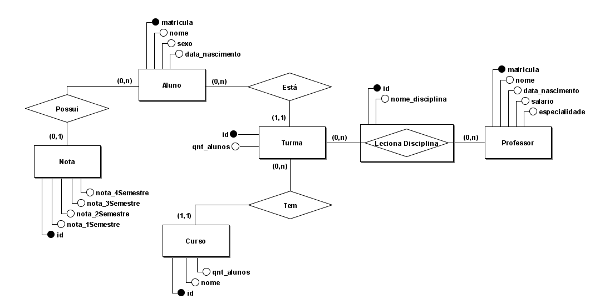
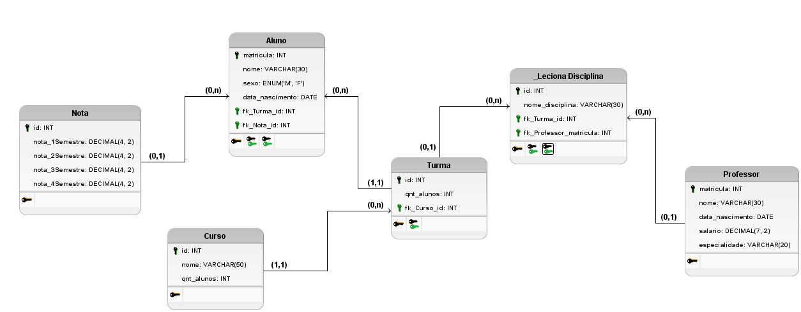

# Concepção da elicitação dos dados do SysSchool
---

### Modelo Entidade Relacionamento - MER

---

### Diagrama Entidade Relacionamento - DER

---

### Log DDL feito no SGBD MariaDB

#### Base de dados do SysSchool 
CREATE DATABASE sysschool;

 

#### Tabela Curso 

CREATE TABLE Curso (
    id INT PRIMARY KEY AUTO_INCREMENT,
    nome VARCHAR(50),
    qnt_alunos INT
);

 

#### Tabela Nota 

CREATE TABLE Nota (
    id INT PRIMARY KEY AUTO_INCREMENT,
    nota_1Semestre DECIMAL(4, 2),
    nota_2Semestre DECIMAL(4, 2),
    nota_3Semestre DECIMAL(4, 2),
    nota_4Semestre DECIMAL(4, 2)
);

 

#### Tabela Professor 

CREATE TABLE Professor (
    matricula INT PRIMARY KEY AUTO_INCREMENT,
    nome VARCHAR(30),
    data_nascimento DATE,
    salario DECIMAL(7, 2),
    especialidade VARCHAR(20)
);

 

#### Tabela Turma 

CREATE TABLE Turma (
    id INT PRIMARY KEY AUTO_INCREMENT,
    qnt_alunos INT,
    fk_Curso_id INT,
    FOREIGN KEY (fk_Curso_id) REFERENCES Curso(id) ON DELETE CASCADE
);

 

#### Tabela Disciplina 

CREATE TABLE Disciplina (
    id INT PRIMARY KEY AUTO_INCREMENT,
    nome_disciplina VARCHAR(30),
    fk_Turma_id INT,
    fk_Professor_matricula INT,
    FOREIGN KEY (fk_Turma_id) REFERENCES Turma(id),
    FOREIGN KEY (fk_Professor_matricula) REFERENCES Professor(matricula)
);
 
 

#### Tabela Aluno 

CREATE TABLE Aluno (
    matricula INT PRIMARY KEY AUTO_INCREMENT,
    nome VARCHAR(30),
    sexo ENUM('M', 'F'),
    data_nascimento DATE,
    fk_Turma_id INT,
    fk_Nota_id INT,
    FOREIGN KEY (fk_Turma_id) REFERENCES Turma(id) ON DELETE CASCADE,
    FOREIGN KEY (fk_Nota_id) REFERENCES Nota(id)
);
 
 
